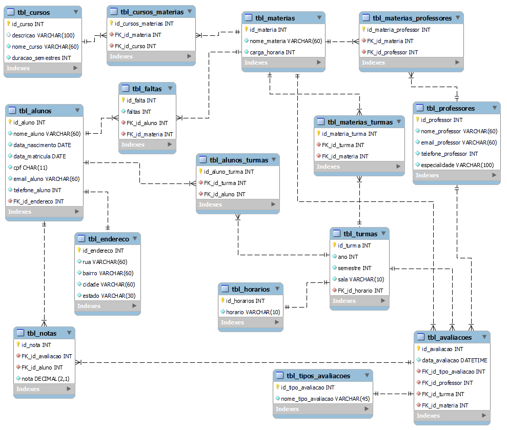

# Banco de Dados para um sistema ficticio de uma faculdade

## Cenário
Os proprietários de uma faculdade precisam de um sistema que viabilize o
armazenamento de informações sobre seus alunos, cursos, matérias e professores para que seja possível realizar controles básicos como montar turmas e realizar o armazenamento de notas dos alunos.

---

## Preview do modelo conceitual

## Preview do modelo lógico

---
## Para testá-lo:
- Se o MySQL Workbench (na versão mais recente, de preferência) já estiver instalado em sua máquina, crie uma conexão (ou entre em uma já criada), depois abra o script `modelo_fisico_script.sql`;
